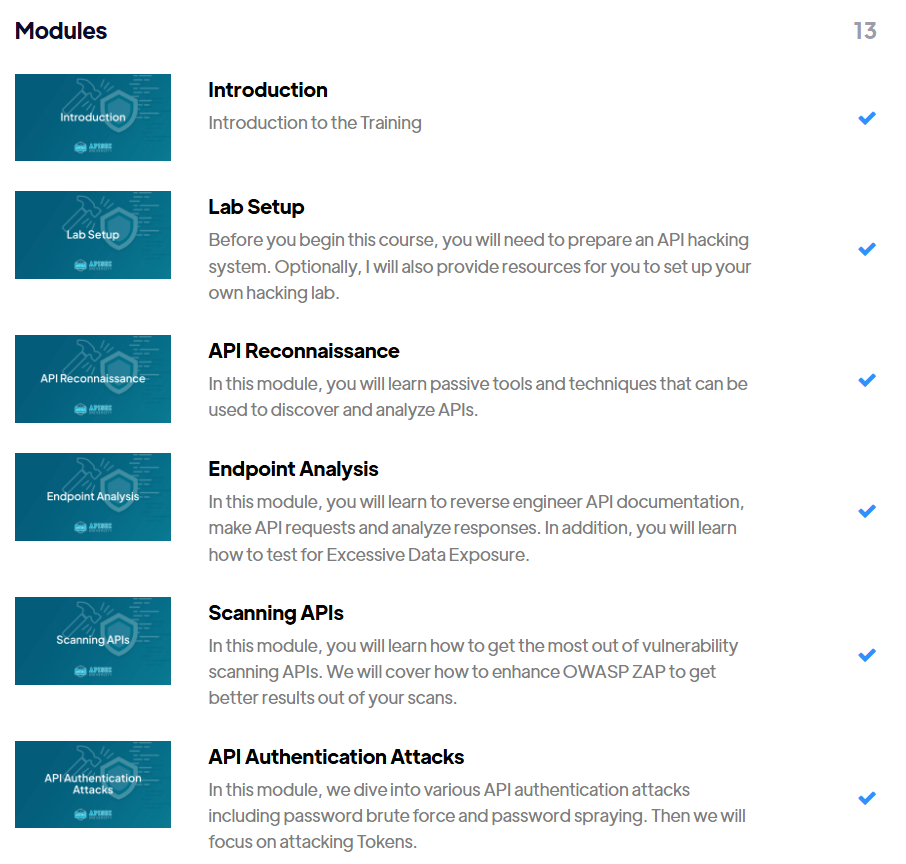
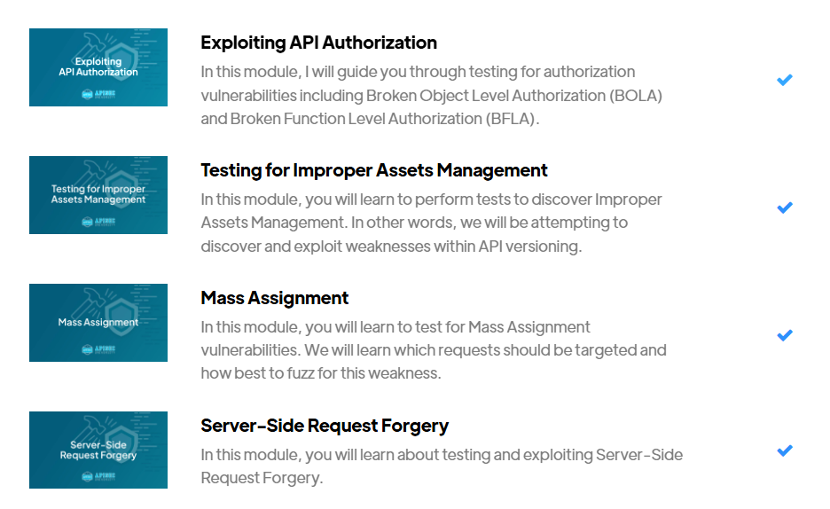
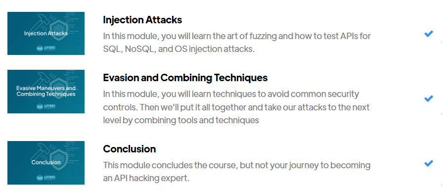

# 🔐 API Penetration Testing (ApiSec University)

This repository contains **notes, labs, cheatsheets, extras, and certificate of completion** for the *API Penetration Testing (12 hours, ApiSec University)* program.  
The course provides a solid foundation in **API security, OWASP API Top 10, attack techniques, and defense strategies**.

---

## 📚 Notes
- 📄 [01-introduction-to-api-security.md](./notes/01-introduction-to-api-security.md) – Introduction to API Security  
- 📄 [02-owasp-api-top10-overview.md](./notes/02-owasp-api-top10-overview.md) – OWASP API Top 10 Overview  
- 📄 [03-authentication-and-authorization.md](./notes/03-authentication-and-authorization.md) – Authentication & Authorization  
- 📄 [04-bola-and-broken-authentication.md](./notes/04-bola-and-broken-authentication.md) – BOLA & Broken Authentication  
- 📄 [05-data-exposure-and-rate-limiting.md](./notes/05-data-exposure-and-rate-limiting.md) – Data Exposure & Rate Limiting  
- 📄 [06-mass-assignment.md](./notes/06-mass-assignment.md) – Mass Assignment Vulnerabilities  
- 📄 [07-security-misconfiguration.md](./notes/07-security-misconfiguration.md) – Security Misconfiguration  
- 📄 [08-injection-attacks.md](./notes/08-injection-attacks.md) – Injection Attacks  
- 📄 [09-improper-assets-management.md](./notes/09-improper-assets-management.md) – Improper Assets Management  
- 📄 [10-logging-and-monitoring.md](./notes/10-logging-and-monitoring.md) – Logging & Monitoring  

---

## 🧪 Labs
- 🔐 [authentication-bypass.md](./labs/authentication-bypass.md) – Authentication Bypass  
- 🛡️ [authorization-issues.md](./labs/authorization-issues.md) – Authorization Issues  
- 📝 [input-validation.md](./labs/input-validation.md) – Input Validation Testing  
- ⚡ [rate-limiting.md](./labs/rate-limiting.md) – Rate Limiting Exploitation  

---

## 📑 Cheatsheets
- 🔎 [api-enumeration.md](./cheatsheets/api-enumeration.md) – API Enumeration  
- 🔑 [jwt-attacks.md](./cheatsheets/jwt-attacks.md) – JWT Attacks  
- 📊 [graphql-queries.md](./cheatsheets/graphql-queries.md) – GraphQL Queries  
- 💥 [common-payloads.md](./cheatsheets/common-payloads.md) – Common Payloads  

---

## 🔬 Extras
- 📑 [case-studies.md](./extras/case-studies.md) – Real-world API security case studies  
- 📆 [timeline.md](./extras/timeline.md) – Attack & defense timeline  
- 📘 [resources.md](./extras/resources.md) – Additional resources  

---

## 📖 Docs
- 📘 [glossary.md](./docs/glossary.md) – API security glossary  
- 📘 [index.md](./docs/index.md) – Program overview  
- 📘 [references.md](./docs/references.md) – References & sources  
- 📘 [roadmap.md](./docs/roadmap.md) – Learning roadmap  
- 📘 [syllabus.md](./docs/syllabus.md) – Course syllabus  

---

## 📸 Screenshots

| Module | Screenshot |
|--------|------------|
| 📘 Modules Overview |  |
| 🔐 API Security Basics |  |
| 🧪 Pentesting Labs |  |

---

## 📜 Certificate
🎓 [API Penetration Testing (ApiSec University)](./cert/APIsecCourseCertificateFinal20250621-27-c084fc.pdf)

---

## 📝 Personal Review
This course enhanced my **pentesting workflow for APIs**.  
The **hands-on labs** on authentication bypass, injection, and rate limiting provided real attack/defense experience.  
Cheatsheets and case studies reinforced **OWASP API Top 10** understanding, making it a great starting point for **API penetration testing professionals**.  

---

## ✍️ Author
**Thành Danh** – Red Team Learner & Security Researcher  

- GitHub: [@ngvuthdanhh](https://github.com/ngvuthdanhh)  
- Email: ngvu.thdanh@gmail.com  

---

## 📄 License
This project is licensed under the terms of the **MIT License**. See [LICENSE](./LICENSE) for full details.  
© 2025 ngvuthdanhh. All rights reserved.
